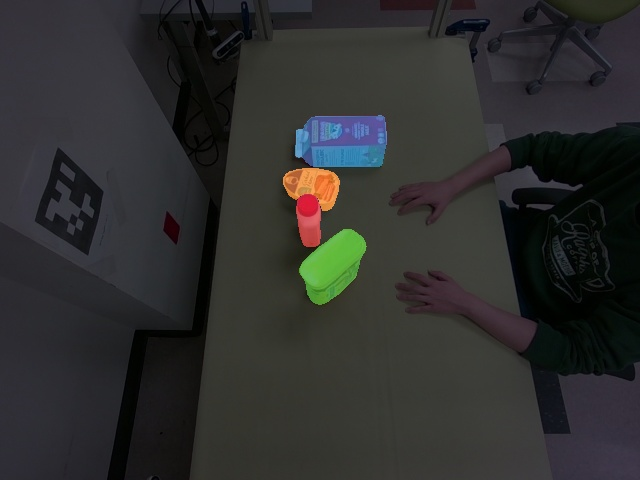
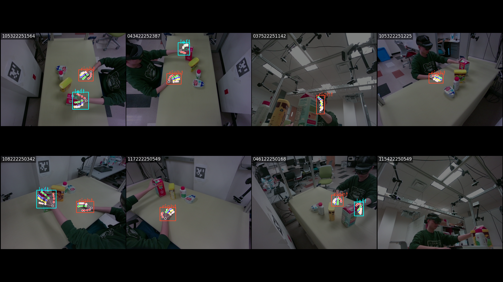
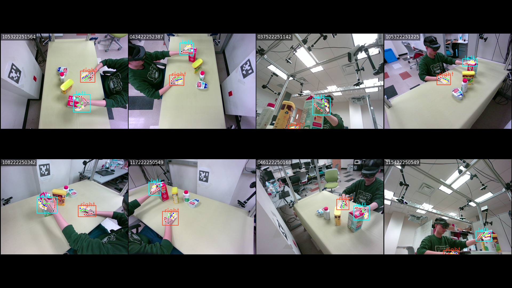
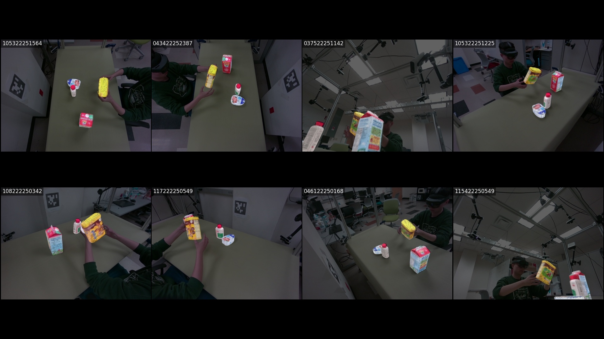
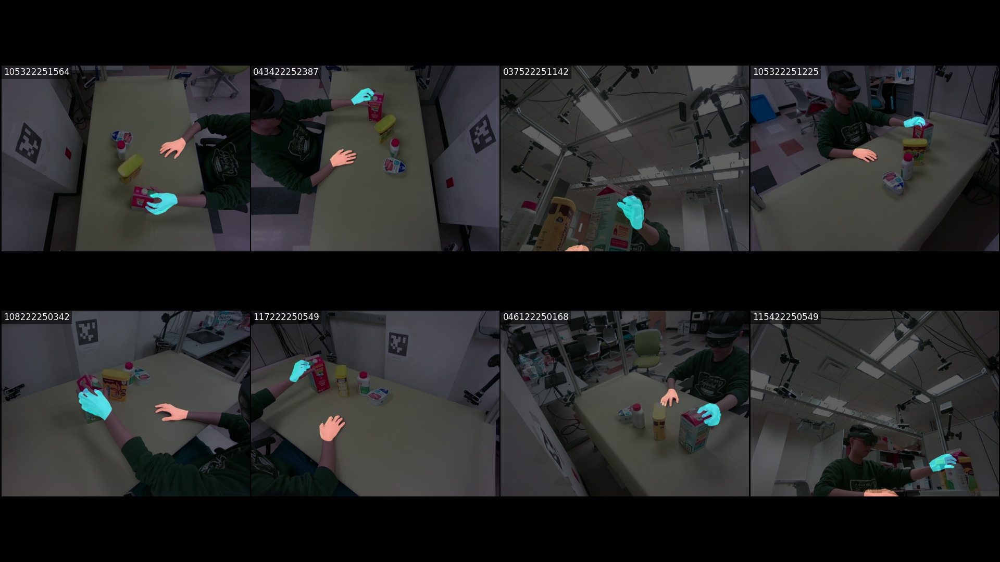
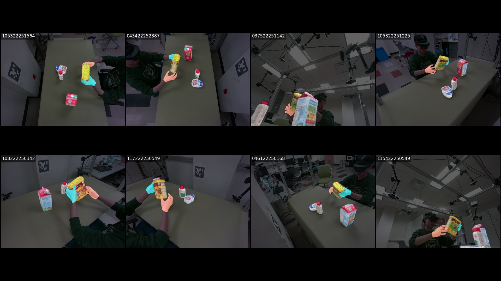
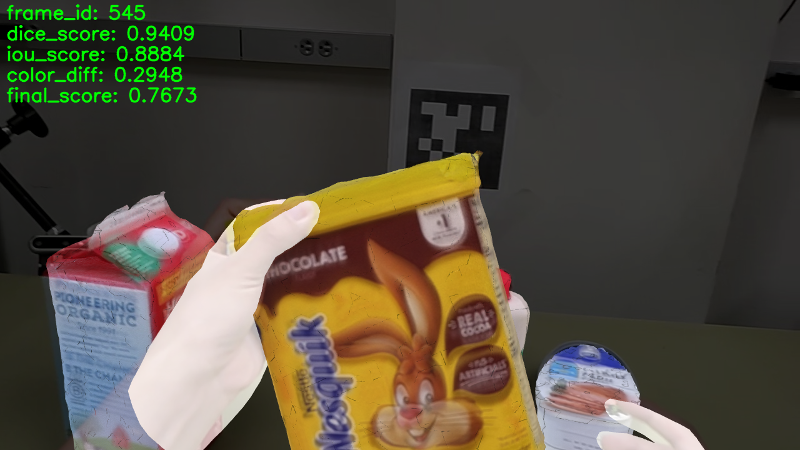

# HO-Cap Annotation Pipeline

[](https://www.python.org/downloads/release/python-31015/)
[](https://pytorch.org/)
[](https://developer.nvidia.com/cuda-toolkit/)
[](https://www.gnu.org/licenses/gpl-3.0.en.html)

This repository contains the code for the HO-Cap annotation pipeline.

## Contents

- [HO-Cap Annotation Pipeline](#ho-cap-annotation-pipeline)
  - [Contents](#contents)
  - [Installation](#installation)
      - [1. Clone the repository](#1-clone-the-repository)
      - [2. Change current directory to the repository](#2-change-current-directory-to-the-repository)
      - [3. Create conda environment](#3-create-conda-environment)
      - [4. Install PyTorch](#4-install-pytorch)
      - [5. Install the HO-Cap Annotation Package](#5-install-the-ho-cap-annotation-package)
      - [6. Download MANO models](#6-download-mano-models)
      - [7. Install Third-Party Tools (Optional)](#7-install-third-party-tools-optional)
        - [7.1 Install FoundationPose](#71-install-foundationpose)
        - [7.2 Install SAM2](#72-install-sam2)
  - [Usage](#usage)
      - [1. Segment the Sequence](#1-segment-the-sequence)
      - [2. 2D Hand Detection by MediaPipe](#2-2d-hand-detection-by-mediapipe)
      - [3. 3D Hand Joints Estimation](#3-3d-hand-joints-estimation)
      - [4. Object Pose Estimation by FoundationPose](#4-object-pose-estimation-by-foundationpose)
      - [5. Hand Pose Optimization](#5-hand-pose-optimization)
      - [6. Object Pose Optimization](#6-object-pose-optimization)
      - [7. Hand-Object Joint Optimization](#7-hand-object-joint-optimization)
      - [8. HoloLens Pose Refinement](#8-hololens-pose-refinement)

## Installation

This code is tested with `Python 3.10` and `CUDA 11.8` on `Ubuntu 20.04`. **Make sure CUDA 11.8 is installed on your system before running the code.**

#### 1. Clone the repository

```bash
git clone https://github.com/JWRoboticsVision/HO-Cap-Annotation.git
```

#### 2. Change current directory to the repository

```bash
cd HO-Cap-Annotation
```

#### 3. Create conda environment

```bash
conda create -n hocap-annotation python=3.10

conda activate hocap-annotation
```

#### 4. Install PyTorch

```bash
python -m pip install torch==2.5.1 torchvision==0.20.1 --index-url https://download.pytorch.org/whl/cu118 --no-cache-dir
```

#### 5. Install the HO-Cap Annotation Package

```bash
bash ./scripts/install_hocap-annotation.sh
```

#### 6. Download MANO models

Download MANO models and code (mano_v1_2.zip) from the [MANO website](https://mano.is.tue.mpg.de/) and place the extracted .pkl files under `config/mano_models` directory. The directory should look like this:

```
./config/mano_models
├── MANO_LEFT.pkl
└── MANO_RIGHT.pkl
```

#### 7. Install Third-Party Tools (Optional)

##### 7.1 Install FoundationPose

- Initialize and build FoundationPose:
  ```bash
  bash ./scripts/install_foundationpose.sh
  ```
- Download checkpoints
  ```
  bash ./scripts/download_models.sh --foundationpose
  ```

##### 7.2 Install SAM2

- Initialize and build SAM2:
  ```bash
  bash ./scripts/install_sam2.sh
  ```
- Download checkpoints
  ```bash
  bash ./scripts/download_models.sh --sam2
  ```

## Usage

#### 1. Segment the Sequence

```bash
python tools/01_video_segmentation.py --sequence_folder <path_to_sequence_folder>
```

|                    Input Mask                     |                           SAM2 Video Segmentation                           |
| :-----------------------------------------------: | :-------------------------------------------------------------------------: |
|  |  |

#### 2. 2D Hand Detection by MediaPipe

```bash
python tools/02_mp_hand_detection.py --sequence_folder <path_to_sequence_folder>
```



#### 3. 3D Hand Joints Estimation

```bash
python tools/03_mp_3d_joints_generation.py --sequence_folder <path_to_sequence_folder>
```



#### 4. Object Pose Estimation by FoundationPose

- Run FoundationPose on each camera view

```bash
python tools/04-1_fd_pose_solver.py --sequence_folder <path_to_sequence_folder> --object_idx <object_idx>
```

- Merge the results from all views

```bash
python tools/04-2_fd_pose_merger.py --sequence_folder <path_to_sequence_folder>
```



#### 5. Hand Pose Optimization

```bash
python tools/05_mano_pose_solver.py --sequence_folder <path_to_sequence_folder>
```



#### 6. Object Pose Optimization

```bash
python tools/06_object_pose_solver.py --sequence_folder <path_to_sequence_folder>
```


#### 7. Hand-Object Joint Optimization

```bash
python tools/07_joint_pose_solver.py --sequence_folder <path_to_sequence_folder>
```



#### 8. HoloLens Pose Refinement

```bash
python tools/08_holo_pose_solver.py --sequence_folder <path_to_sequence_folder>
```


